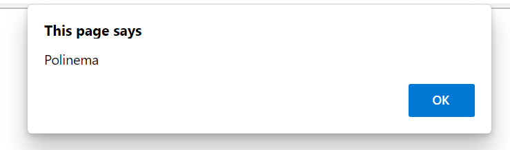
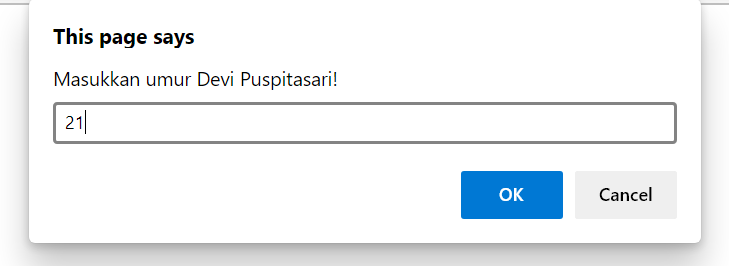
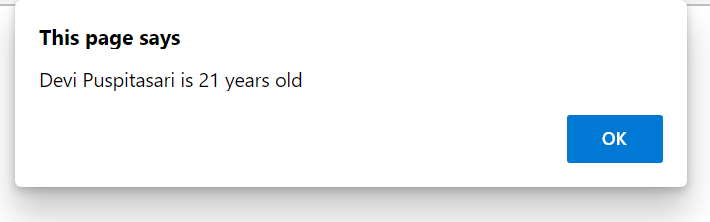
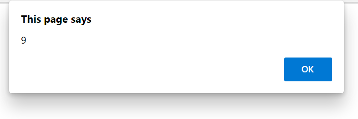
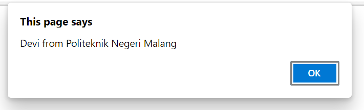
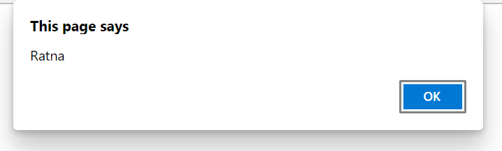
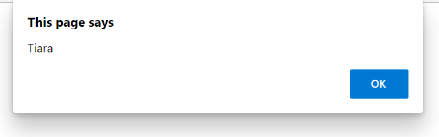
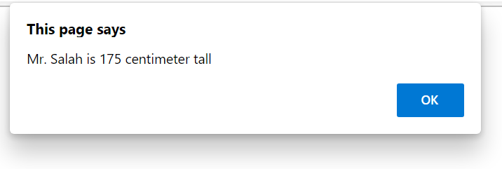
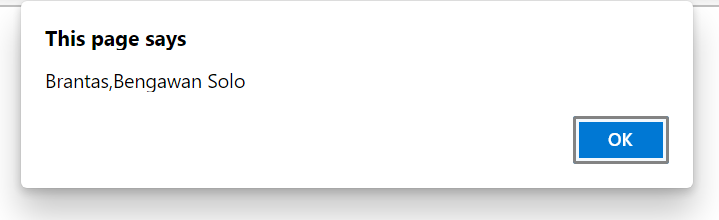
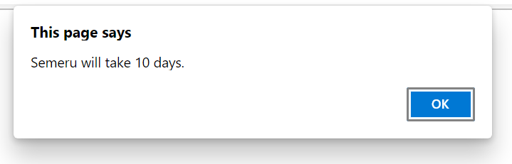

# 01 - Modern JavaScript

## Tujuan Praktikum
1. Mahasiswa dapat mengetahui dan mengimplemantasikan kegunaan variables using const.
2. Mahasiswa dapat mengetahui dan mengimplemantasikan kegunaan variables using let.
3. Mahasiswa dapat mengetahui dan mengimplemantasikan kegunaan template string.
4. Mahasiswa dapat mengetahui dan mengimplemantasikan kegunaan arrow function.
5. Mahasiswa dapat mengetahui dan mengimplemantasikan kegunaan destructuring object.
6. Mahasiswa dapat mengetahui dan mengimplemantasikan kegunaan destructuring an array.
7. Mahasiswa dapat mengetahui dan mengimplemantasikan kegunaan spread and rest operator.
8. Mahasiswa dapat mengetahui dan mengimplemantasikan kegunaan classes constructor and
super.

## Hasil Praktikum 

1. Membuat variabel menggunakan const

    

2. Membuat variabel menggunakan let

    

3. Membuat Template Strings

    

    

4. Membuat default parameters

    

5. Membuat Arrow Function 1

    

6. Membuat Arrow Function 2

    

7. Membuat Destructuring Object

    

8. Membuat Destructuring an Array

    

    

9. Membuat Restructuring

    

10. Membuat Spread and Rest operator

    - Spread
    
    

    - Rest operator

    

11. Membuat Classes Constructor and Super

    

    